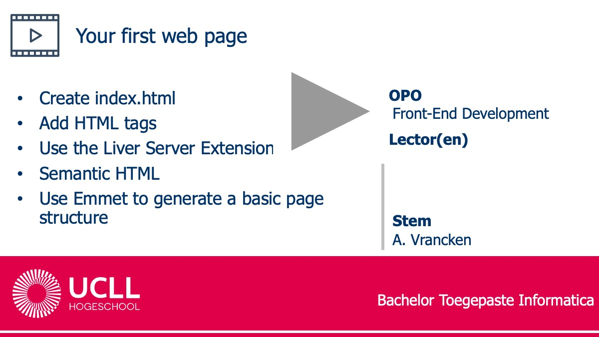

# Create your GitHub Repo and deploy it with GitHub Pages

## GitHub Classroom
1. Install Git on your device (cfr Challenges of Introduction Project)
1. Navigate to https://github.com/ and log in.
1. Navigate to the [GitHub Classroom Assignment](https://classroom.github.com/a/FlkNDRlK) that you can find on Toledo > Assignments
1. Select your name in the roster. If it is not present, continue.
1. Accept the assignment. A Repo is created in organisation UCLL-Front-Student with name site-username (e.g. https://github.com/UCLL-FrontEnd-student/site-janJanssens)
1. Open the repository in your browser. It contains  read.me and .gitignore.
1. Copy the url of your repository.
1. Clone the repository to your device. First navigate to the desired directory on your laptop.
1. Open the repo in VS Code.
1. Create a file index.html. Save it.
1. Commit and push the modified repo to GitHub.
1. Find the new file on your online repository

## GitHub Pages
1. Open the settings of your repo. Click on “Pages”.
1. Choose the main branch. Click “save”. Your website is built by GitHub. This can take a while. 
1. Click on “Visit site” (top of the page). Your website is shown. Be patient: the build can take a while.
1. The url should look like https://ucll-frontend-student.github.io/site-janJanssens